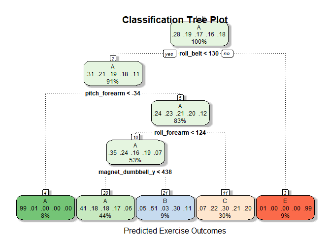

## Overview
This analysis was performed on a set of data to determine how well participants performed an exercise involving dumbell curls.  Using data gathered from accelerometers on the participant and exercise equipment, analysis was performed to determine whether the participant performed the exercise correctly.  Five results were possible.  This analysis takes training data to determine an accurate model to predict these exercise movements from a test set of 20 variables.

The analysis shows that a Random Forest model can can accurately predict these outcomes 99.4% of the time.
Reference site: http://groupware.les.inf.puc-rio.br/har 

### Getting the Data

Files are downloaded from the Coursera site.  There are two files; Training and Testing.  Both files are cleaned to remove
Variables that are missing data or do not contribute building the models.  The Training set is divided into a small sample for validation of the models.  The Training data has the true outcome for the variable - "classe" that we are trying to predict.  That is omitted from the Testing dataset and will be predicted using the final selected model.


```r
library(caret)
```

```
## Warning: package 'caret' was built under R version 3.4.4
```

```
## Loading required package: lattice
```

```
## Loading required package: ggplot2
```

```
## Warning: package 'ggplot2' was built under R version 3.4.4
```

```r
library(rattle)
```

```
## Warning: package 'rattle' was built under R version 3.4.4
```

```
## Rattle: A free graphical interface for data science with R.
## Version 5.1.0 Copyright (c) 2006-2017 Togaware Pty Ltd.
## Type 'rattle()' to shake, rattle, and roll your data.
```

```r
library(knitr)
```

```
## Warning: package 'knitr' was built under R version 3.4.4
```

```r
setwd("D:/My_Files/Documents/Coursera/08_PracticalMachineLearning/Project/")
if(!file.exists("./data")){dir.create("./data")}
# download training set
fileUrl <- "https://d396qusza40orc.cloudfront.net/predmachlearn/pml-training.csv"
if(!file.exists("./data/pml-training.csv")){
        download.file(fileUrl,destfile="./data/pml-training.csv", mode = "wb")}
# Download testing set
fileUrl1 <- "https://d396qusza40orc.cloudfront.net/predmachlearn/pml-testing.csv"
if(!file.exists("./data/pml-testing.csv")){
        download.file(fileUrl1,destfile="./data/pml-testing.csv", mode = "wb")}

# Load the data
test <- read.csv("./data/pml-testing.csv", header=TRUE, na.strings = c("NA", ""))
training <- read.csv("./data/pml-training.csv", header=TRUE, na.strings = c("NA", ""))

# cleaning data to remove columns with no data or of little impact to model creation
test <- test[, colSums(is.na(test)) == 0]
training <- training[, colSums(is.na(training)) == 0]

# Removing names, time data, and window variables from columns 1-7 into working data sets

traindat <- training[, -c(1:7)] 
testdat  <- test[, -c(1:7)]

## split training set to provide a validation set
set.seed(61618) 
inTrain <- createDataPartition(traindat$classe, p = 0.7, list = FALSE)
train <- traindat[inTrain, ]
valid <- traindat[-inTrain, ]
```


### Model Selection

After reviewing and cleaning the data both training and test sets contain 53 variables.  The training set contains the "classe" variable which is the outcome that will be predicted.  Three models will be used for comparison, Classification Tree, Random Forest, and finally Linear Discriminant Analysis.  In all models I make use of the cross validation technique using 5 folds.  During exploratory analysis 10 folds were also used, but did not increase accuracy significantly.


```r
trControl <- trainControl(method = "cv", number = 5)
```

### Round 1 Classification Trees

```r
modFit <- train(classe~., data=train, method="rpart", trControl=trControl)
finMod <- modFit$finalModel
print(modFit)
```

```
## CART 
## 
## 13737 samples
##    52 predictor
##     5 classes: 'A', 'B', 'C', 'D', 'E' 
## 
## No pre-processing
## Resampling: Cross-Validated (5 fold) 
## Summary of sample sizes: 10989, 10991, 10990, 10988, 10990 
## Resampling results across tuning parameters:
## 
##   cp          Accuracy   Kappa    
##   0.04119622  0.5105145  0.3701900
##   0.05030007  0.4136256  0.2054326
##   0.11707863  0.3510203  0.1015476
## 
## Accuracy was used to select the optimal model using the largest value.
## The final value used for the model was cp = 0.04119622.
```

```r
fancyRpartPlot(finMod)  ## Print the tree
```

<!-- -->

```r
## prediction based on the model using partial training data
pred1 <- predict(modFit, newdata=valid)
confmat <- confusionMatrix(valid$classe, pred1)

# table of accuracy of the model
confmat$table
```

```
##           Reference
## Prediction    A    B    C    D    E
##          A 1521   20  131    0    2
##          B  481  309  349    0    0
##          C  492   18  516    0    0
##          D  438  170  356    0    0
##          E  151   67  396    0  468
```

```r
# overall accuracy of classification trees model
confmat$overall[1]
```

```
##  Accuracy 
## 0.4781648
```

The classification tree model did not produce very accurate predictions, less than 50% accuracy.  None of the "D classe" were predicted.


### Round 2 Random Forest Model

Random Forest model is used to predict values based on the partial test data carved out for validation purposes.

```r
modFit2<- train(classe ~ ., data=train,  
               method = "rf", trControl = trControl)
finMod2 <- modFit2$finalModel
print(modFit2)
```

```
## Random Forest 
## 
## 13737 samples
##    52 predictor
##     5 classes: 'A', 'B', 'C', 'D', 'E' 
## 
## No pre-processing
## Resampling: Cross-Validated (5 fold) 
## Summary of sample sizes: 10990, 10989, 10990, 10989, 10990 
## Resampling results across tuning parameters:
## 
##   mtry  Accuracy   Kappa    
##    2    0.9901727  0.9875670
##   27    0.9909735  0.9885805
##   52    0.9850047  0.9810278
## 
## Accuracy was used to select the optimal model using the largest value.
## The final value used for the model was mtry = 27.
```

```r
pred2 <- predict(modFit2, newdata=valid)
confmat2 <- confusionMatrix(valid$classe, pred2)
# Table of predictions vs true values
confmat2$table
```

```
##           Reference
## Prediction    A    B    C    D    E
##          A 1674    0    0    0    0
##          B    8 1126    5    0    0
##          C    0    3 1017    6    0
##          D    0    0    8  956    0
##          E    0    0    0    4 1078
```

```r
# overall accuracy of the Random Forest Model
confmat2$overall[1]
```

```
##  Accuracy 
## 0.9942226
```

The Random Forest model is a significant improvement over the Classification Tree model.  99.4% accuracy was attained.  This model did take the longest time to run.

### Round 3 Linear Disciminant Analysis Model

In most cases Linear Discriminant Analysis will give a relatively accurate predition.  I am including it for comparison to the other models.


```r
modFit3 <- train(classe ~ ., data=train , method = "lda", trControl = trControl)
finMod3 <- modFit3$finalModel
print(modFit3)
```

```
## Linear Discriminant Analysis 
## 
## 13737 samples
##    52 predictor
##     5 classes: 'A', 'B', 'C', 'D', 'E' 
## 
## No pre-processing
## Resampling: Cross-Validated (5 fold) 
## Summary of sample sizes: 10989, 10991, 10991, 10988, 10989 
## Resampling results:
## 
##   Accuracy   Kappa    
##   0.7015349  0.6221703
```

```r
pred3 <- predict(modFit3, newdata=valid)
confmat3 <- confusionMatrix(valid$classe, pred3)
# Table of predictions vs true values
confmat3$table
```

```
##           Reference
## Prediction    A    B    C    D    E
##          A 1371   29  141  128    5
##          B  169  751  125   51   43
##          C   91   95  690  126   24
##          D   66   29  138  699   32
##          E   37  192  108  115  630
```

```r
# overall accuracy of the LDA Model
confmat3$overall[1]
```

```
##  Accuracy 
## 0.7036534
```

LDA resulted in 70.4% accuracy.  Given the results of the other models, I will select Random Forest for the final model.

### Errors for the selected Model


```r
plot(modFit2$finalModel, main="Model Errors for Random Forest")
```

<!-- -->

### Prediction against the Testing Data

using the Random Forest model, I can now make a prediction against the test set that was provided.  The test set contains 20 tests and the goal is to predict the "classe" based on the variables.  The Random Forest model proved to be very accurate in testing against a subset of the training data provided.   Given the expected accuracy of 99.4%, I expected and out of sample error rate of 0.6%.  

```r
finalpred <- predict(modFit2, newdata = testdat)  #using the Random Forest Model
# finalpred
kable(data.frame(c(1:20), finalpred))  #using kable for better printing.
```


 c.1.20.  finalpred 
--------  ----------
       1  B         
       2  A         
       3  B         
       4  A         
       5  A         
       6  E         
       7  D         
       8  B         
       9  A         
      10  A         
      11  B         
      12  C         
      13  B         
      14  A         
      15  E         
      16  E         
      17  A         
      18  B         
      19  B         
      20  B         

